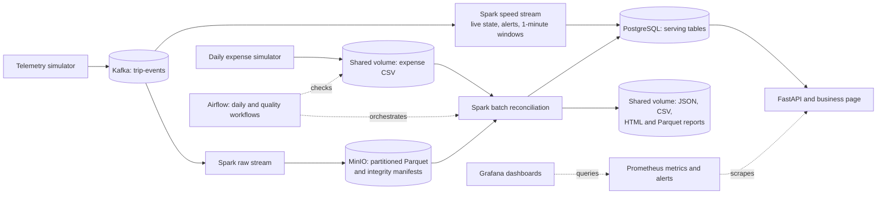

# Fleet Lambda Platform

A local, end-to-end big-data demonstration for ride-hailing operations. Simulated
vehicle events provide near-real-time fleet and zone insights; daily expense
files are reconciled with archived trips to produce vehicle profitability.
The system uses a **Lambda architecture**: a speed path for immediate answers
and a batch path for authoritative historical reports.

This is a classroom deployment on one Docker host, not a production service.
One simulated day lasts five real minutes; monetary values are integer LKR
cents. See the [final delivered scope](docs/FINAL_SCOPE.md) for detailed
behavior and limitations.

## Architecture



Solid arrows show data movement; dashed arrows show orchestration or
monitoring. The quality workflow also checks archive and report integrity.

Kafka's three-partition topic buffers and replays telemetry. Two independent
Spark Structured Streaming consumers read it: the speed consumer updates
PostgreSQL, while the raw consumer commits immutable Parquet to MinIO. Airflow
orchestrates Spark reconciliation of that archive with the daily expense CSV.
This separation lets a corrected cost file restate historical results without
rewriting source events. PostgreSQL serves indexed live and daily queries;
MinIO/Parquet retains the reusable event history. The batch path may briefly
lag the speed path. [Architecture decisions](docs/adr/) explain the Lambda,
Spark, and PostgreSQL choices.

## Start locally

You need Docker Desktop with Linux containers, Docker Compose v2, Python 3.11,
PowerShell 7 for the commands below, at least 8 GB available to Docker, and
internet access for the first image build. From the repository root:

```powershell
py -3.11 -m scripts.bootstrap_env
docker compose up --build -d
docker compose ps -a
```

The bootstrap command creates a git-ignored `.env` with random local secrets;
it will not overwrite one. Keep this file private. Initialization containers
exit after setup; that is expected. On a fresh dataset, the first expense file
arrives after about five minutes; Airflow can then produce the first daily
report. Builds may take longer on a cold machine.

Open these localhost interfaces:

- [Business page and API](http://localhost:8001/) · [API documentation](http://localhost:8001/docs)
- [Pipeline health](http://localhost:8001/health/pipeline) · [Report health](http://localhost:8001/health/reports)
- [Airflow](http://localhost:8080) · [Grafana](http://localhost:3000) · [Prometheus](http://localhost:9090) · [MinIO console](http://localhost:9001)

Airflow, Grafana, and MinIO credentials are in `.env`. Ports bind to
`127.0.0.1`; Kafka and PostgreSQL are not exposed to the host. A running page
does not guarantee fresh data, so check both health endpoints before a demo.

To stop the platform without removing its named volumes, run
`docker compose down`. Do **not** use `--volumes` unless you intend to erase the
demonstration dataset. See [advanced operations](docs/OPERATIONS.md) for logs,
migration, recovery, and benchmark procedures.

## Verify

Install the host-side test dependencies and run the unit/API/archive suite:

```powershell
py -3.11 -m venv .venv
.\.venv\Scripts\python -m pip install -r requirements-dev.txt
.\.venv\Scripts\python -m unittest discover -s tests -q
docker compose config --quiet
```

The last recorded host run completed 59 tests with one expected skip: the
Spark/Python parity test needs PySpark in the application image. Run that test
and the isolated reconciliation checks there:

```powershell
docker compose run --rm --no-deps tools python -m unittest tests.test_completion.SparkPythonParityTests -v
docker compose run --rm tools python -m scripts.verify_reconciliation
```

Check the running platform and a clean set of disposable volumes with:

```powershell
.\.venv\Scripts\python -m scripts.verify_running --wait-seconds 480
.\.venv\Scripts\python -m scripts.verify_clean_install
```

The [saved verification evidence](output/evidence/final-verification.json)
records passing live, isolated, and fresh-volume checks. The clean-install
check used new volumes on the same Docker host; a second-computer installation
has not been demonstrated. The short 10/100/500 events-per-second runs in the
[benchmark evidence](output/evidence/performance-benchmark.json) do not establish
sustained production capacity.

## Interpret results safely

Live state is indicative; daily profitability is recomputed from committed
archive data. Missing expenses or telemetry and conflicting event identities
produce explicit unknown/incomplete outcomes, not invented profit or loss.
Invalid inputs are quarantined. Report exports are published as JSON, CSV,
HTML, and Parquet with a digest manifest. This platform does not claim
end-to-end exactly-once delivery.

The deployment uses one Kafka broker, local Spark workers, single-node MinIO,
and one PostgreSQL instance. It has no external TLS, API authentication,
replication, or disaster-recovery automation. Do not expose it publicly.

## Submission and team

- [Final report PDF](output/pdf/fleet-lambda-platform-report.pdf)
- [Submission ZIP](output/fleet-lambda-platform-submission.zip)
- [Demo runbook](docs/DEMO_RUNBOOK.md) and [viva questions](docs/VIVA_QA.md)
- [Contribution statement](docs/CONTRIBUTION_STATEMENT.md)

The three University of Ruhuna BSc Computer Engineering members led distinct,
equally weighted work areas:

- **Threemavithana T.M. (EG/2021/4835):** platform and ingestion - deployment,
  simulation, Kafka, MinIO archive, and monitoring.
- **Senevirathne P.U.S (EG/2021/4805):** stream processing and serving - event
  contracts, Spark speed layer, PostgreSQL serving, and FastAPI.
- **Kodikara A.W. (EG/2021/4613):** batch processing and data quality - Airflow,
  Spark reconciliation, quarantine, and daily reports.

All three share responsibility for the architecture, integration, testing,
documentation, final report, and live demonstration. Each should be able to
explain the complete system.
